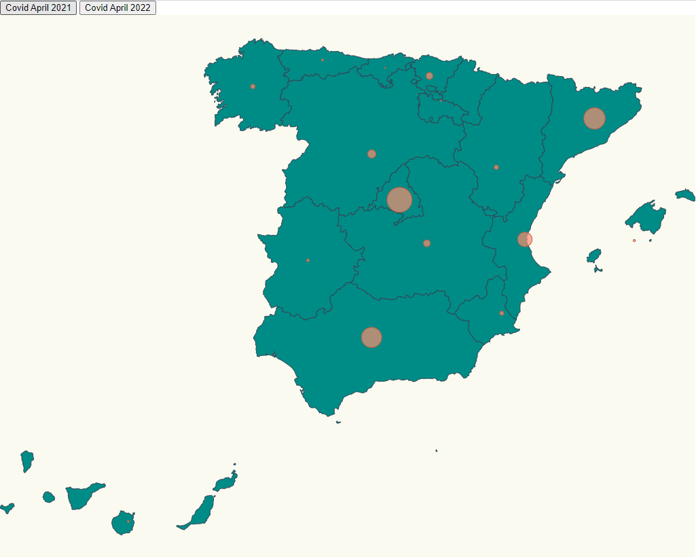
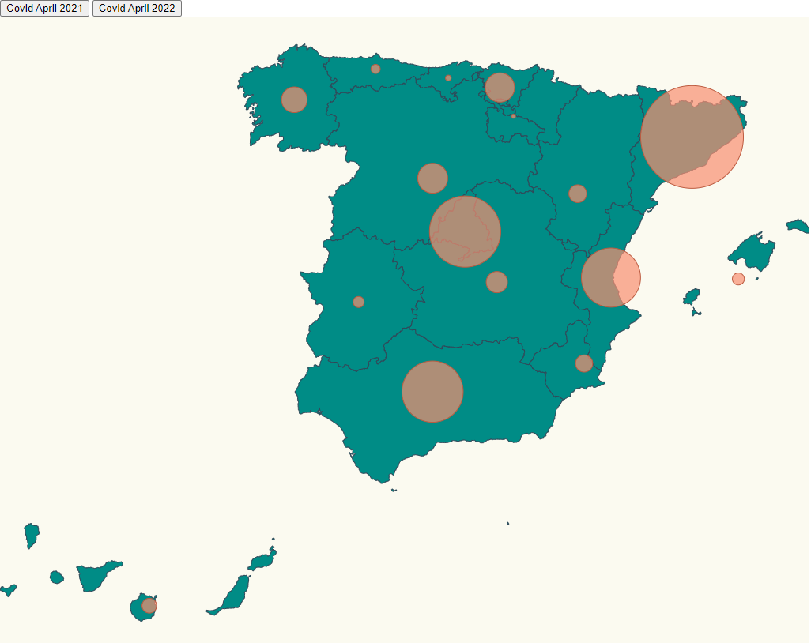

# Covid cases + pinning locations

In this work has been plotted the map of Spain with the Covid cases per autonomous community, two options can be selected: 
- Covid cases in April 2021



- Covid cases in April 2022
We can see how much is the difference between the two dates and how some autonomous communities have been developed the Covid cases. 



codesandbox: https://codesandbox.io/s/hopeful-ellis-rlczx

We have to face three challenges here:

- Place pins on a map based on location.
- Scale pin radius based on affected number of covid cases.
- Spain got canary island that is a territory placed far away, we need to cropt that islands and paste them in a visible place in the map.

# Steps

- We will take as starting example _00-render-map-hover_ and _02-pin-location-scale_, let's copy the content from that folder and execute _npm install_.

```bash
npm install
```

- This time we will see Spain topojson info: https://github.com/deldersveld/topojson/blob/master/countries/spain/spain-comunidad-with-canary-islands.json

Let's copy it under the following route _./src/spain.json_

- Now instead of importing _europe.json_ we will import _spain.json_, _covid_04_2021_, _covid_04_2022_, _ResultEntry_

_./src/index.ts_

```diff
import * as d3 from "d3";
import * as topojson from "topojson-client";
- const europejson = require("./europe.json");
+ const spainjson = require("./spain.json");
```

- Let's build the spainjson:

_./src/index.ts_

```diff
+ const spainjson = require("./spain.json");
```

- If we run the project, we will get some bitter-sweet feelings, we can see a map of spain,
  but it's too small, and on the other hand, canary islands are shown far away (that's normal,
  but usually in maps these islands are relocated).


- If we run the project we can check that the map is now renders in a proper size and position, let's
  go for the next challenge, we want to reposition Canary Islands, in order to do that we can build a
  map projection that positions that piece of land in another place, for instance for the USA you can
  find Albers USA projection: https://bl.ocks.org/mbostock/2869946, there's a great project created by
  [Roger Veciana](https://github.com/rveciana) that implements a lot of projections for several
  maps:

  - [Project site](https://geoexamples.com/d3-composite-projections/)
  - [Github project](https://github.com/rveciana/d3-composite-projections)

Let's install the library that contains this projections:

```bash
npm install d3-composite-projections --save
```

- Let's import it in our _index.ts_ (we will use require since we don't have typings).

```diff
+ const d3Composite = require("d3-composite-projections");
```

- Let's change the projection we are using (we will need to tweak as well the
  _scale_ and _translate_ values):

_./src/index.ts_

```diff
const aProjection =
-   d3
-  .geoMercator()
+  d3Composite
+  .geoConicConformalSpain()
```

- Let's define the geoPath of the projection:
```diff
const aProjection =
+   d3
+  .geoPath()
+  .projection(aProjection);
```

- Let's define the geojson:
```diff
+ const geojson = 
+    topojson
+    .feature(spainjson, spainjson.objects.ESP_adm1);
```

- Let's set the projection size to adjust with geojson:
```diff
+ aProjection
+ .fitSize([1024, 800], geojson);
```

- Let's define the layout, the size, and background color:
```typescript
// Defining the layout, body, svg, width, height and the background color
const svg = d3
  .select("body")
  .append("svg")
  .attr("width", 1024)
  .attr("height", 800)
  .attr("style", "background-color: #FBFAF0");
```

- Let's define the geojson:

```typescript
// Defining the geojson
svg
  .selectAll("path")
  .data(geojson["features"])
  .enter()
  .append("path")
  .attr("class", "country")
  // use geoPath to convert the data into the current projection
  // https://stackoverflow.com/questions/35892627/d3-map-d-attribute
  .attr("d", geoPath as any);
```

- If we run the project, voila ! we got the map just the way we want it.

- Now we want to display a circle in the middle of each community (autonomous community) to represent the number of covid cases in each community, we have collected the latitude and longitude for each community, let's add them to our project.

_./src/communities.ts_

```typescript
export const latLongCommunities = [
  {
    name: "Madrid",
    long: -3.70256,
    lat: 40.4165,
  },
  {
    name: "Andalucía",
    long: -4.5,
    lat: 37.6,
  },
  {
    name: "Valencia",
    long: -0.37739,
    lat: 39.45975,
  },
  {
    name: "Murcia",
    long: -1.13004,
    lat: 37.98704,
  },
  {
    name: "Extremadura",
    long: -6.16667,
    lat: 39.16667,
  },
  {
    name: "Cataluña",
    long: 1.86768,
    lat: 41.82046,
  },
  {
    name: "País Vasco",
    long: -2.75,
    lat: 43.0,
  },
  {
    name: "Cantabria",
    long: -4.03333,
    lat: 43.2,
  },
  {
    name: "Asturias",
    long: -5.86112,
    lat: 43.36662,
  },
  {
    name: "Galicia",
    long: -7.86621,
    lat: 42.75508,
  },
  {
    name: "Aragón",
    long: -1.0,
    lat: 41.0,
  },
  {
    name: "Castilla y León",
    long: -4.45,
    lat: 41.383333,
  },
  {
    name: "Castilla La Mancha",
    long: -3.000033,
    lat: 39.500011,
  },
  {
    name: "Islas Canarias",
    long: -15.5,
    lat: 28.0,
  },
  {
    name: "Islas Baleares",
    long: 2.52136,
    lat: 39.18969,
  },
  {
    name: "Navarra",
    long: -1.65,
    lat: 42.816666,
  },
  {
    name: "La Rioja",
    long: -2.445556,
    lat: 42.465,
  },
];
```

- Let's import it:

_./src/index.ts_

```diff
import * as d3 from "d3";
import * as topojson from "topojson-client";
+ import { latLongCommunities } from "./communities";
```

- We will add the covid cases for april 2021 and april 2022 that we need to display (affected persons per community):

_./stats.ts_

```typescript
// Covid data until 04-2022
export const covid_04_2022: ResultEntry[] = [
{
    name: "Madrid",
    value: 1647605,
},
{
    name: "La Rioja",
    value: 93973,
},
{
    name: "Andalucía",
    value: 1417273,
},
{
    name: "Cataluña",
    value: 2377290,
},
{
    name: "Valencia",
    value: 1368795,
},
{
    name: "Murcia",
    value: 398468,
},
{
    name: "Extremadura",
    value: 255370,
},
{
    name: "Castilla La Mancha",
    value: 492636,
},
{
    name: "País Vasco",
    value: 677893,
},
{
    name: "Cantabria",
    value: 131625,
},
{
    name: "Asturias",
    value: 210439,
},
{
    name: "Galicia",
    value: 594525,
},
{
    name: "Aragón",
    value: 410714,
},
{
    name: "Castilla y León",
    value: 692509,
},
{
    name: "Islas Canarias",
    value: 341182,
},
{
    name: "Islas Baleares",
    value: 277195,
},
];
  
// Covid data until 04-2021
export const covid_04_2021: ResultEntry[] = [
    {
      name: "Madrid",
      value: 673030,
    },
    {
      name: "La Rioja",
      value: 29351,
    },
    {
      name: "Andalucía",
      value: 545483,
    },
    {
      name: "Cataluña",
      value: 577407,
    },
    {
      name: "Valencia",
      value: 389876,
    },
    {
      name: "Murcia",
      value: 110466,
    },
    {
      name: "Extremadura",
      value: 73621,
    },
    {
      name: "Castilla La Mancha",
      value: 183854,
    },
    {
      name: "País Vasco",
      value: 182435,
    },
    {
      name: "Cantabria",
      value: 28310,
    },
    {
      name: "Asturias",
      value: 50342,
    },
    {
      name: "Galicia",
      value: 121177,
    },
    {
      name: "Aragón",
      value: 116959,
    },
    {
      name: "Castilla y León",
      value: 221515,
    },
    {
      name: "Islas Canarias",
      value: 52033,
    },
    {
      name: "Islas Baleares",
      value: 59016,
    },
  ];
```

- Let's import it into our index.ts

_./src/index.ts_

```diff
import * as d3 from "d3";
import * as topojson from "topojson-client";
const spainjson = require("./spain.json");
const d3Composite = require("d3-composite-projections");
import { latLongCommunities } from "./communities";
+ // Covid data per community, cases accumulated until 19-04-2022
+ import { covid_04_2022 } from "./data/covid_stats";
+ // Covid data per community, cases accumulated until 19-04-2021
+ import { covid_04_2021 } from "./data/covid_stats";
+ // Import resultentry, type of data
+ import { ResultEntry } from "./data/covid_stats";
// Spain json
const spainjson = require("./spain.json");
// Projections for canary island
const d3Composite = require("d3-composite-projections");

```

- Let's calculate the maximum number of cases of all communities, this value I've setted the maximum value of covid cases in april 2022, because as we know the covid cases are the accumulated in all the pandemic:

_./src/index.ts_

```typescript
const maxCovid_04_2022 = covid_04_2022.reduce(
  (max, item) => (item.value > max ? item.value: max),
  0
)
```

- Let's create an scale to map affected to radius size, all the circles will be scaled with this maximum value, so april 2021 as we know that there are less cases there will be smaller circles.

_./src/index.ts_

```typescript
const affectedRadiusScale = d3
  .scaleLinear()
  .domain([0, maxCovid_04_2022])
  .range([0, 65]); // 65 pixel max radius, we could calculate it relative to width and height
```

- As we know the functionality let us change from covid data 2021 to covid data 2022, first we decide to show the covid data of April 2021.

```typescript
// Define the first data to show
let currentCovidStat = covid_04_2021;
```

- Let's create a helper function to glue the community name with the affected cases, taking the current covid dat defined.

_./src/index.ts_

```typescript
// Calculate the radius of each community depending on the number of cases
const calculateRadiusBasedOnAffectedCases = (comunidad: string) => {
  const entry = currentCovidStat.find((item) => item.name === comunidad);

  return entry ? affectedRadiusScale(entry.value) : 0;
};
```

- And let's append at the bottom of the _index_ file a
  code to render a circle on top of each community. 

_./src/index.ts_

```typescript
// Painting the circles
svg
  .selectAll("circle")
  .data(latLongCommunities)
  .enter()
  .append("circle")
  .attr("class", "affected-marker")
  .attr("r", (d) => calculateRadiusBasedOnAffectedCases(d.name))
  .attr("cx", (d) => aProjection([d.long, d.lat])[0])
  .attr("cy", (d) => aProjection([d.long, d.lat])[1])
  // When I shift the mouse over the element will move itself
  // Using the function catch the html element associated
  .on("mouseover", function() {
    d3
      .select(this)
      .attr("transform", `scale(1.05, 1.05)`);
  })
  .on("mouseout", function() {
    d3
      .select(this)
      .attr("transform", ``);
  })
;
```

- As we know the main functionality shall let us change from covid data of April 2021 and covid data April 2022, let's add how to define de constant to update the chart.

```typescript
// Defining the chart that is going to change the covid cases
const updateChart = (data: ResultEntry[]) => {
  currentCovidStat = data;
  // Selecciono el path y actualizo los datos
  svg  
    .selectAll("circle")
    .data(latLongCommunities)
    // as we have paint the circles before we don't need to append them
    .attr("class", "affected-marker")
    .attr("r", (d) => calculateRadiusBasedOnAffectedCases(d.name))
    .attr("cx", (d) => aProjection([d.long, d.lat])[0])
    .attr("cy", (d) => aProjection([d.long, d.lat])[1])
    .transition()
    .duration(500);
};
```

- Now, let's add the button ids to know which data show in the map:

```typescript
// Adding the data when click the button of april 2021
document
  .getElementById('april_2021')
  .addEventListener('click', () => {
    updateChart(covid_04_2021);
  });

// Adding the data when click the button of april 2022
document
  .getElementById('april_2022')
  .addEventListener('click', () => {
    updateChart(covid_04_2022);
  });
  
```

- Nice ! we got an spot on top of each community, now is time to
  make this spot size relative to the number of affected cases per community.

In the file _index.html_ I've added the two buttons to select if we want to see the covid cases in april 2021 or april 2022.

```typescript
<html>
  <head>
    <link rel="stylesheet" type="text/css" href="./map.css" />
    <link rel="stylesheet" type="text/css" href="./base.css" />
  </head>
  <body>
    <div>
      <button id="april_2021">Covid April 2021</button>
      <button id="april_2022">Covid April 2022</button>
    </div>
    <script type="module" src="./index.ts"></script>
  </body>
</html>
```

./src/base.css let us defined the style for the layout.

- Black circles are ugly let's add some styles, we will just use a red background and
  add some transparency to let the user see the spot and the map under that spot.

./src/map.css

```diff
.country {
  stroke-width: 1;
  stroke: #2f4858;
  fill: #008c86;
}

.affected-marker {
  stroke-width: 1;
  stroke: #bc5b40;
  fill: #f88f70;
  fill-opacity: 0.7;
}
```

